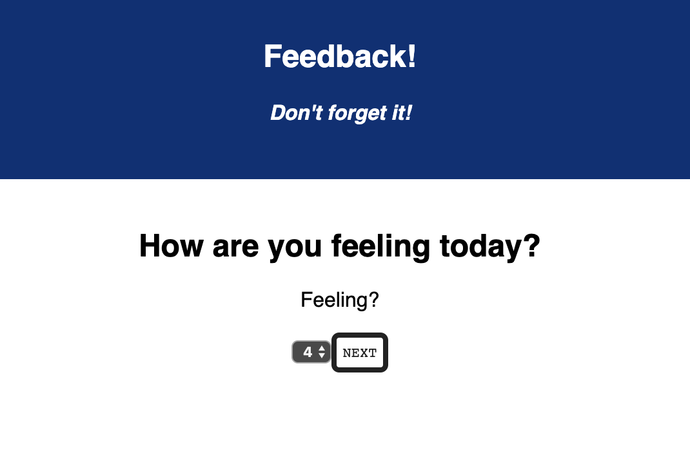
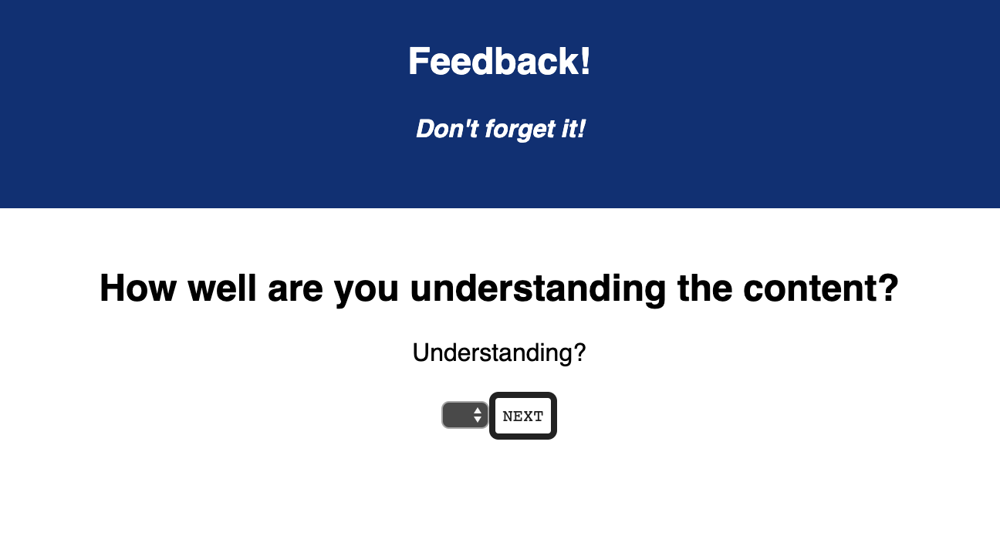
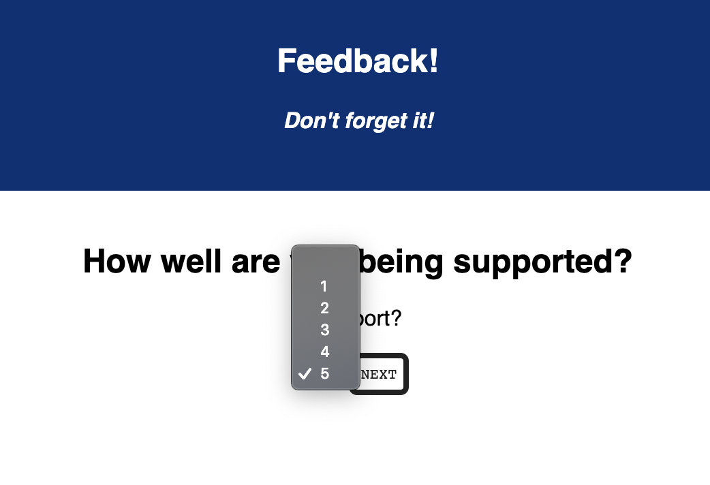
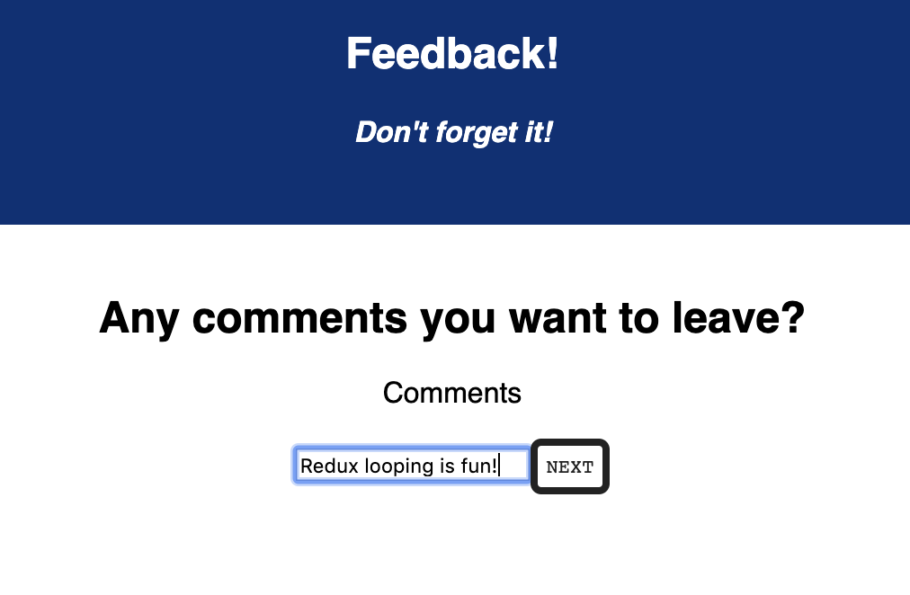
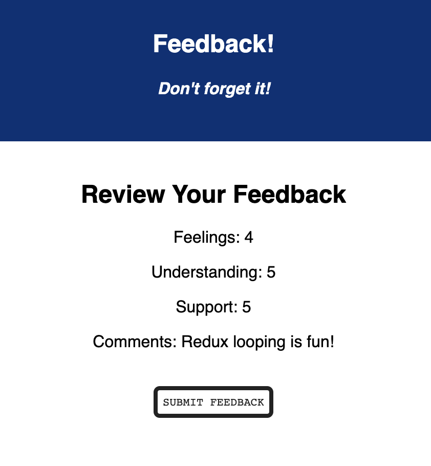
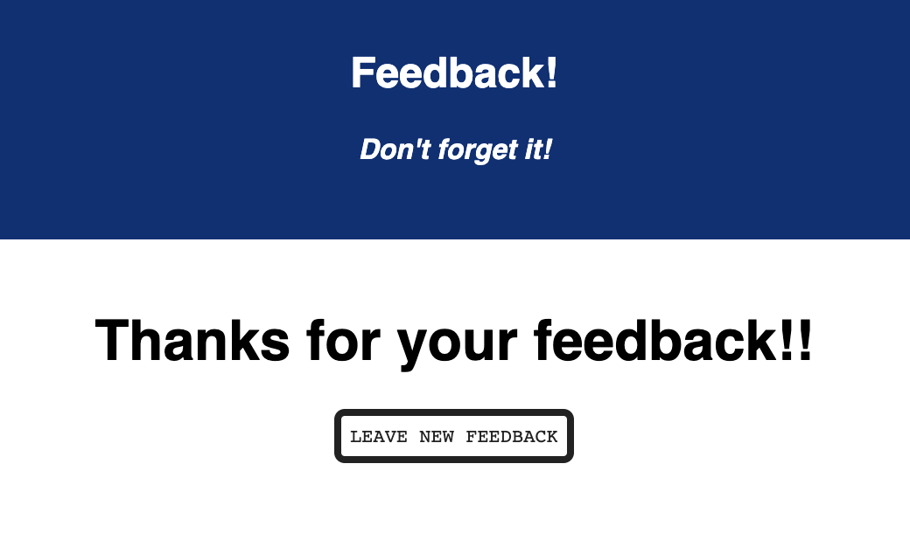

# Redux Feedback Loop

## Description
*Duration: Weekend Project*

The application is a multiple-part form for users to leave daily feedback. Each part will prompt the user to answer a question. Once answered, the user can click the "next" button to proceed to the next question. After the form is completed, the user will then be prompted to review the feedback before submitting. Once submitted, the user will be directed back to the first question to leave any additional feedback.

## Screen Shot

## Built With
- Visual Studio Code
- React.js
- Node Version 12.11.1
- Postgres/Postico

## Acknowledgement
Thanks to Prime Digital Academy in Minneapolis who equipped and helped me to make this application a reality.

## Support
If you have suggestions or issues, please email me at hayleyhollermann.com